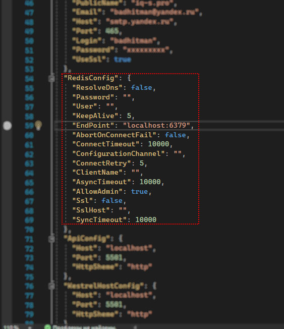
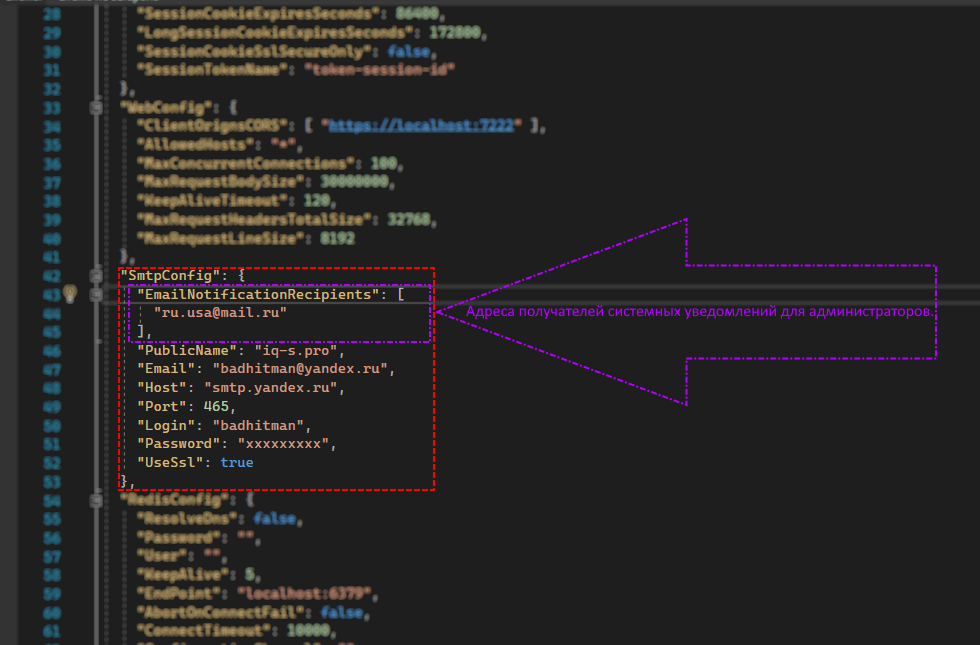
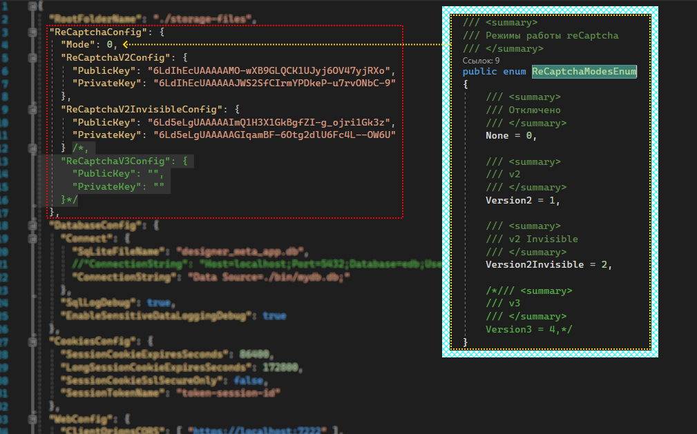
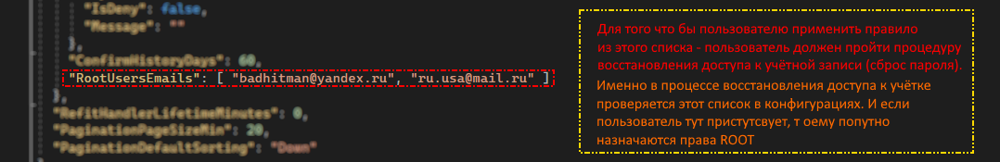
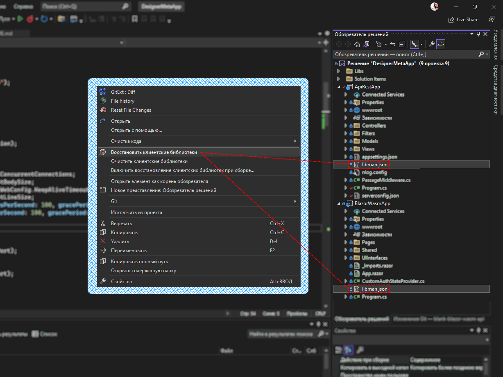
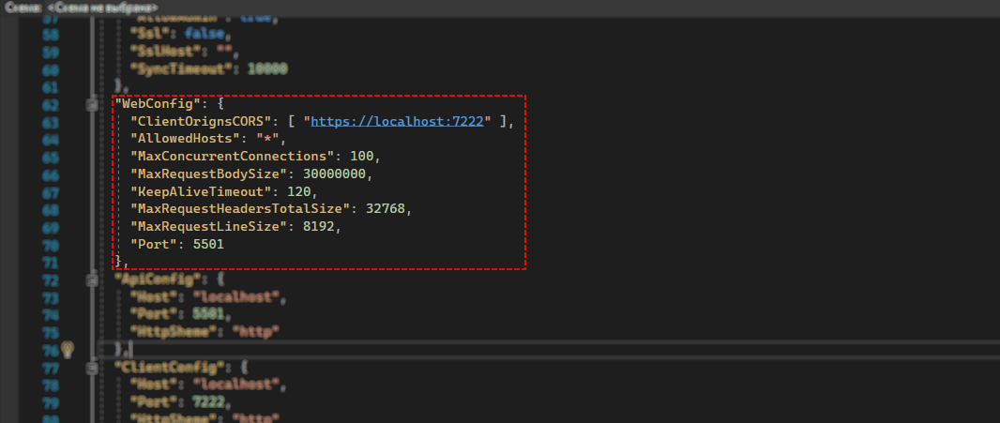
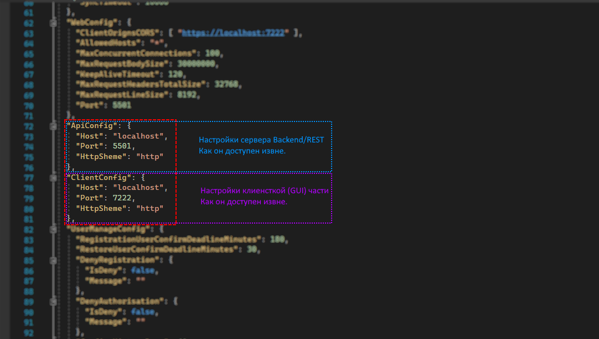
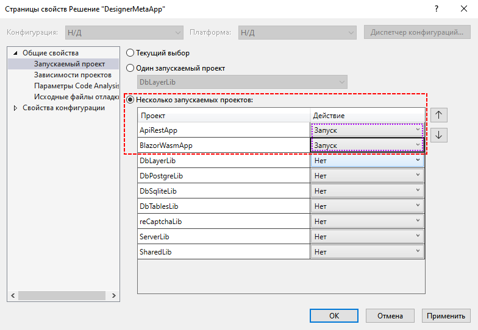

# .NET6 BlazorWasm custom authorization +WebApi of Refit
Кастомная авторизация Blazor WebAssembly в связке с WebApi (через Refit) в т.ч. вертикальная иерархия прав (сквозная между UI и API).

На базе этого решения ведутся работы над [конструктором](https://github.com/badhitman/blank-blazor-wasm-api/tree/constructor) (ветка: **constructor**).
Конструктор позволяет сформировать структуру бизнес-моделей, используя web интерфейс. Готовую структуру можно выгрузить в набор файлов,
готовых к интеграции в main решение. Генератор создаёт файлы типов данных, связи между ними, контекст данных бд и стартовый набор служб доступа к этим данным (crud)

## Перед запуском
Для успешного запуска потребуется Redis. По умолчанию ожидается, что он запущен на том же сервере (localhost:6379),
но если это не так, то нужно поправить конфигурацию (serverconfig.json/serverconfig.Development.json):



Так же потребуется настройть SMTP (для функционирования системы подтверждения регистрации пользователя, восстановления пароля пользователя и т.п.):



[reCaptcha](https://developers.google.com/recaptcha/intro) - по умолчанию настроена на localhost и отключена.
Для локального теста достаточно перевести её в нужный режим (Mode: 1 или 2). Настройки предусматриваю сразу двух версий:
 - [reCAPTCHA v2 ("I'm not a robot" Checkbox)](https://developers.google.com/recaptcha/docs/versions#recaptcha_v2_im_not_a_robot_checkbox)
 - [reCAPTCHA v2 (Invisible reCAPTCHA badge)](https://developers.google.com/recaptcha/docs/versions#recaptcha_v2_invisible_recaptcha_badge)

но какой из них используется в конкретном случае - указывает параметр Mode (1 или 2). Либо 0, если отключено.



Пользователи с правами ROOT определяются так же в конфигурации (других способов стать ROOT не существует):



Проверьте состояние клиентских библиотек и восстановите их в случае необходимости:



Web настройки для хоста Kestrel (в т.ч. Listen Port):



Публичные Web настройки точек доступа:



База данных в данный момент используется SQLite (но это не точно). При этом я стараюсь разделять сервисы таким образом, что бы перевод на другую бд был простым и безболезненным.
> например, для переключения на Postgree - достаточно сменить строку подключения в конфигах **ApiRestApp** и заменить зависимости в двух проектах.

### Три простых шага для переключения на нужную СУБД!
На данны момент протестировано две СУБД: SQLite и Postgre. Для включения той или иной СУБД требуется три действия:
 - Установите строку подключения к БД в конфигах ApiRestApp. В зависимости от желаемой СУБД вы должны прописать необходимый коннект.
 ```json
 "DatabaseConfig": {
    "Connect": {
      "ConnectionString": "Host=localhost;Port=5432;Database=edb;Username=postgres;Password=555555555"
      //"ConnectionString": "Data Source=./bin/mydb.db;"
    },
    "SqlLogDebug": true,
    "EnableSensitiveDataLoggingDebug": true
  }
 ```
 - Для проекта **DbTablesLib** установите одну из зависимостей от целевого проекта. Если выбрана *SQLite*, то необходима зависимость от проекта **DbSqliteLib**. В то же время, убедитесь что бы небыло зависимости на проект **DbPostgreLib**. Если же выбрана *Postgre*, то проекту (DbTablesLib) потребуется зависимость на **DbPostgreLib**, НО НЕ **DbSqliteLib** (зависимость от двух сразу не допускается)
 - Для проекта **ServerLib** установите зависимости так же и для проекта **DbTablesLib**

## Запуск


Иерархия/уровни прав формируется перечислением:

```c#
public enum AccessLevelsUsersEnum
{
    Anonim = -20,

    /// <summary>
    /// Заблокирован
    /// </summary>
    [Display(Name = "Заблокирован", Description = "Заблокирован")]
    Blocked = -10,

    /// <summary>
    /// Зарегистрированный (но НЕ подтверждённый)
    /// </summary>
    [Display(Name = "Зарегистрированый", Description = "Рядовой зарегистрированный пользователь (не подтверждённый)")]
    Auth = 10,

    /// <summary>
    /// Подтверждён (подтвердил по Email и/или Telegram)
    /// </summary>
    [Display(Name = "Проверенный", Description = "Подтверждённый пользователь (подтвердил по Email и/или Telegram)")]
    Confirmed = 20,

    /// <summary>
    /// Привилегированный
    /// </summary>
    [Display(Name = "Привилегированный", Description = "Особые разрешения, но не администрация")]
    Trusted = 30,

    /// <summary>
    /// 4.Менеджер (управляющий/модератор)
    /// </summary>
    [Display(Name = "Менеджер/Модератор", Description = "Младший администратор")]
    Manager = 40,

    /// <summary>
    /// Администратор
    /// </summary>
    Admin = 50,

    /// <summary>
    /// Владелец (суперпользователь)
    /// </summary>
    [Display(Name = "ROOT/Суперпользователь")]
    ROOT = 60
}
```
> в готовой иерархии индексы специально раряженые, что бы в случае необходимости было возможно добавить дополнительные/промежуточные уровни без нарушения ссылочной/логической целостности данных пользователей в БД.

Смысл данной иерархии такой, что на контроллер либо его метод (а в Razor политика) устанавливается минимальный требуемый уровень доступа при помощи специального атрибута фильтра авторизации,

```c#
/// <summary>
/// Получить профиль пользователя
/// </summary>
/// <param name="id"></param>
/// <returns></returns>
[HttpGet("{id}")]
[TypeFilter(typeof(AuthAsyncFilterAttribute), Arguments = new object[] { AccessLevelsUsersEnum.Confirmed })]
public async Task<GetUserProfileResponseModel> Get([FromRoute] int id)
{
```

пользователь в свою очередь имеет того же типа поле. Вот по нему и проходит проверка уровня доступа.

```c#
public AccessLevelsUsersEnum AccessLevelUser { get; set; } = AccessLevelsUsersEnum.Anonim;
```

а на стороне Blazor клиента реализован схожий механизм, но силами политик
```razor
<AuthorizeView Policy="MinimumLevelConfirmed">
            <Authorized>
```

Имя политики формируется из ```MinimumLevel``` и имени уровня доступа. Например: ```MinimumLevelConfirmed``` или ```MinimumLevelManager```

для поддержки данного хозяйства на клиенте Blazor (wasm) регистрируется требуемая оснаска:

```c#
builder.Services.InitAccessMinLevelHandler();
```

```c#
public static void InitAccessMinLevelHandler(this IServiceCollection services)
{
    services.AddSingleton<IAuthorizationPolicyProvider, MinimumLevelPolicyProvider>();
    services.AddSingleton<IAuthorizationHandler, MinimumLevelAuthorizationHandler>();

    services.AddAuthorizationCore(opts =>
    {
        opts.DefaultPolicy = new AuthorizationPolicyBuilder()
            .RequireAuthenticatedUser()
            .Build();
    });
}
```

а так же

```c#
builder.Services.AddScoped<CustomAuthStateProvider>();
```

на серверной стороне регистрировать ни чего не требуется. Фильтр выполняет всё что требуется

```c#
public class AuthAsyncFilterAttribute : Attribute, IAuthorizationFilter
{
    ISessionService _session_service;
    AccessLevelsUsersEnum _minimum_access_level;
    public AuthAsyncFilterAttribute(ISessionService set_session_service, AccessLevelsUsersEnum set_minimum_access_level)//
    {
        _session_service = set_session_service;
        _minimum_access_level = set_minimum_access_level;
    }

    void IAuthorizationFilter.OnAuthorization(AuthorizationFilterContext context)
    {
        if (_minimum_access_level > _session_service.SessionMarker.AccessLevelUser)
        {
            context.Result = new ObjectResult(new ResponseBaseModel() { IsSuccess = false, Message = "Не достаточно прав для доступа к ресурсу" });
        }
    }
}
```

В случае неудачи прохождения контроля доступа - возвращается базовый класс от которого, кстати говоря, наследуются все ответы всех контроллеров (по крайней мере те, которые подразумевают ответ).
```c#
ResponseBaseModel()
{
    IsSuccess = false,
    Message = "Не достаточно прав для доступа к ресурсу" 
}
``` 

Сессии со стороны сервера сейчас хранятся в Redis. Если быть точным, то сессии обслуживаются мемкешем, который сейчас реализован на движке Redis.
```c#
builder.Services.AddSingleton<IManualMemoryCashe, RedisMemoryCasheService>();
```
если мемкеш реализовать на другом сервисе, то сессии будут жить в этом новом месте.

###### Базовый функционал системы авторизации/регистрации
- Регистрация, вход, выход.
- Подтверждение регистрации (по Email пользователя). 
- Сброс/изменение пароля (восстановление доступа по Email).
- reCaptcha v2 (в т.ч. Invisible)
- сессия от Blazor Wasm к WEB Api пробрасывется через Refit/HTTP Header. На стороне браузера сессия хранится в Кукисах.

На старте работает с Redis, но легко переводится на другие рельсы через реализацию интерфейса
```c#
builder.Services.AddSingleton<IManualMemoryCashe, RedisMemoryCasheService>();
```

сессии целиком обрабатываются в
```c#
builder.Services.AddScoped<ISessionService, SessionService>();
```